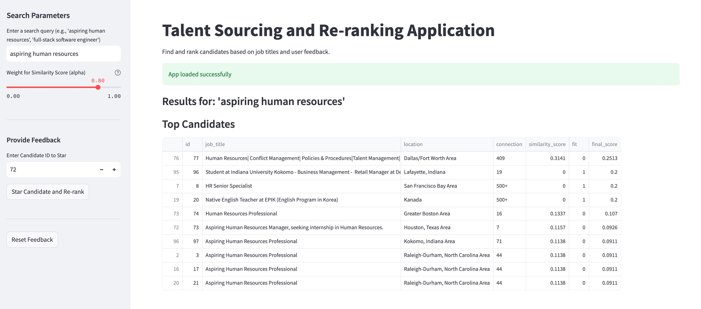

# 🚀 AI-Powered Talent Sourcing & Candidate Ranking System


---

## 📌 Project Overview

This project objective was to design an intelligent system to **identify, rank, and continuously improve candidate selection** for specific job roles. 

This project develops a talent sourcing and ranking application designed to help identify and prioritize potential candidates for various roles based on their job titles and user feedback. It explores different text vectorization techniques and implements a re-ranking algorithm to refine candidate lists.

The solution tackles a real-world hiring challenge:

**How can we automatically identify the best candidates for a role and continuously improve rankings using human feedback?**

To solve this, the system leverages a combination of:

- Natural Language Processing (NLP)
- Transformer-based models and LLMs
- Human-in-the-loop feedback

The solution tackles a real-world hiring challenge:

> *How can we automatically identify the best candidates for a role and continuously improve rankings using human feedback?*

---

## 🎯 Objectives

The goal of this project is to automate and improve the talent sourcing process. It tackles challenges such as identifying suitable candidates, ranking them effectively, and incorporating human feedback to continuously enhance the ranking system. The application leverages natural language processing (NLP) to understand job titles and determine candidate fit.

---

## 🧠 Key Features

- ✅ **Exploratory Data Analysis (EDA):** Initial analysis of candidate data, including connection distribution and top locations.
- ✅ **Text Preprocessing:** Cleaning and standardizing job titles using techniques like tokenization, stopword removal, stemming, and regex for noise reduction.
- ✅ **Text Vectorization:** Implementation and comparison of various methods to convert job titles into numerical representations:
    -   Bag of Words (BoW)
    -   TF-IDF (Term Frequency-Inverse Document Frequency)
    -   Word2Vec
    -   GloVe
    -   FastText
    -   BERT (Bidirectional Encoder Representations from Transformers)
    -   SBERT (Sentence-BERT)
- ✅ **User Feedback Re-ranking:** A mechanism to re-rank candidates by incorporating user feedback (e.g., 'starring' a candidate) to adjust their 'fit' score.
- ✅ **Streamlit Application:** A web application for interactive searching, ranking, and feedback collection.

---

## 🏗️ System Design Diagram

<center> </center>


---
## 🔄  End-to-End Workflow

The solution follows a comprehensive workflow to achieve its goals:

1.  **Data Loading & Initial Inspection:** Candidate data is loaded, and initial exploratory data analysis (EDA) is performed to understand its structure, identify missing values, and gain preliminary insights into `connection` and `location` distributions.
2.  **Text Preprocessing:** The `job_title` column undergoes a rigorous preprocessing pipeline including lowercasing, tokenization, regex-based cleaning, stopword removal, punctuation stripping, and Porter stemming. This ensures consistent and clean text for vectorization.
3.  **Text Vectorization & Comparison:** Cleaned job titles are transformed into numerical vectors using multiple techniques:
    *   **Lexical Models:** Bag of Words (BoW) and TF-IDF (Term Frequency-Inverse Document Frequency).
    *   **Word Embedding Models:** Word2Vec, GloVe, and FastText.
    *   **Contextual Embedding Models:** BERT and SBERT.
    Each method is used to rank candidates based on cosine similarity to a search query, and their performance is comparatively analyzed.
4.  **Re-ranking with User Feedback:** A crucial component, this module allows human feedback (e.g., 'starring' a candidate) to influence subsequent rankings. When a candidate is starred, their 'fit' score is updated, and a combined score (weighted average of similarity and normalized fit) is calculated for re-ranking.
5.  **Application Deployment:** The entire system is packaged into a Streamlit web application. Essential models (like `tfidf_vectorizer`) and processed dataframes are saved and loaded by the app. The application is deployed to Hugging Face Spaces using a `Dockerfile` and `requirements.txt` for environment setup.

---
## ⚠️ Bias Mitigation Strategies
Addressing bias is crucial for fair and equitable talent sourcing. While this project focuses on technical ranking, several strategies can be integrated to mitigate bias:

*   **Bias-Aware Data Preparation:** Carefully review and preprocess job titles and other candidate data to identify and potentially neutralize any implicit demographic indicators or biased language that could be inadvertently learned by the models.
*   **Algorithmic Bias Mitigation:** Explore techniques to debias word embeddings or integrate fairness constraints if a predictive model for 'fit' were to be trained with demographic data (used ethically and legally).
*   **Explainable AI (XAI):** Provide transparency by showing *why* a candidate was ranked highly (e.g., feature importance, contributing keywords). This helps human reviewers scrutinize the relevance criteria and identify potential biases in the system's reasoning.
*   **Blind Screening Principles:** For initial review, present candidate information in a 'blind' format, redacting names, photos, and other easily identifiable personal information to reduce unconscious bias during human assessment.
*   **Diverse Feedback Providers:** Ensure that the individuals providing feedback (e.g., 'starring' candidates) represent a diverse group to prevent the reinforcement of existing biases through the re-ranking mechanism.
*   **Continuous Monitoring:** Regularly audit the system's performance for any disparate impact on different groups and adapt strategies as needed.

---
## ✅ Final output:

<center> </center>

---

## 📈 Performance Benchmarks
Throughout the project, various text vectorization methods were evaluated for their effectiveness in ranking candidates. The key observations include:

*   **SBERT and BERT (Generic):** These models consistently demonstrated superior performance in capturing semantic relevance. They yielded the highest and most tightly clustered similarity scores for semantically focused queries (e.g., 'aspiring human resources'). This indicates their strong ability to understand the context and nuances of language, leading to highly accurate matches even when exact keywords are not present.
*   **Word2Vec, GloVe, and FastText:** These word embedding models also performed well in identifying semantically similar roles, often ranking relevant titles high. While their scores might be slightly lower or vary more compared to transformer-based models, they showed strong semantic capabilities, outperforming traditional lexical methods.
*   **TF-IDF and Bag of Words (BoW):** These lexical models successfully identified job titles containing exact keywords but generally exhibited lower and more varied similarity scores for semantically similar but lexically different phrases. They are effective for direct keyword matching but are less adept at understanding deeper semantic relationships.

In summary, models capable of semantic understanding (especially SBERT and BERT) provide more robust and consistent rankings for talent sourcing compared to purely lexical models.


---

## 🛠️ Tech Stack

-   **Python:** The primary programming language.
-   **Jupyter/Google Colab:** For notebook development and experimentation.
-   **Pandas:** For data manipulation and analysis.
-   **NumPy:** For numerical operations.
-   **Scikit-learn:** For various machine learning utilities, including `TfidfVectorizer` and `cosine_similarity`.
-   **NLTK:** For natural language processing tasks like tokenization and stemming.
-   **Gensim:** For Word2Vec and FastText model handling.
-   **Hugging Face Transformers & Sentence-Transformers:** For BERT and SBERT embeddings.
-   **Matplotlib & Seaborn:** For data visualization.
-   **Streamlit:** For building the interactive web application.
-   **Hugging Face Spaces:** For deploying the web application.
---

## ✅ Installation

To run this project locally, follow these steps:

1.  **Clone the repository:**
    ```bash
    git clone <your-repository-url>
    cd <your-repository-name>
    ```

2.  **Create a virtual environment (recommended):**
    ```bash
    python -m venv venv
    source venv/bin/activate  # On Windows use `venv\Scripts\activate`
    ```

3.  **Install dependencies:**
    The `requirements.txt` file lists all necessary Python packages.
    ```bash
    pip install -r backend_files/requirements.txt
    ```

4.  **Download NLTK data:**
    NLTK is used for text preprocessing. The `Dockerfile` handles this for deployment, but for local execution, you might need to download `stopwords` and `punkt` corpora.
    ```python
    import nltk
    nltk.download('stopwords')
    nltk.download('punkt')
    ```

5.  **Prepare `backend_files`:**
    Ensure that the `backend_files` directory contains the necessary model and data artifacts:
    -   `final_ranking_model.joblib` (DataFrame)
    -   `tfidf_vectorizer.joblib`
    -   `tfidf_matrix.joblib`
    -   `app.py` (Streamlit application script)
    -   `requirements.txt`
    -   `Dockerfile`

    *Note: These files are typically generated by running the full Jupyter/Colab notebook provided.* If you are using the Colab notebook, ensure you run all cells to generate these artifacts.

### ✅ Usage

Once installed, you can run the Streamlit application locally:

```bash
streamlit run backend_files/app.py

```
This will open the application in your web browser, usually at `http://localhost:8501`

---

### ✅ Application Features:

-   **Search Query:** Enter a job title or role (e.g., "aspiring human resources", "full-stack software engineer") to get ranked candidates.
-   **Similarity Weight (Alpha):** Adjust the slider to control the influence of semantic similarity versus user feedback in the final ranking score.
-   **Star Candidate:** Select a candidate ID and click "Star Candidate and Re-rank" to mark them as a good fit. The system will then re-rank the candidates, giving more weight to previously starred individuals.
-   **Reset Feedback:** Clear all user feedback to revert to the initial similarity-based ranking.

### ✅  Deployment to Hugging Face Spaces:

- The project includes a `Dockerfile` and `requirements.txt` to facilitate deployment on platforms like Hugging Face Spaces. The notebook automates the process of saving necessary files into the `backend_files` directory and uploading them to a specified Hugging Face Space.
---
###  🙌 Conclusion

- This project demonstrates a robust approach to talent sourcing using various NLP techniques. The comparative analysis of vectorization methods highlights the trade-offs between lexical (BoW, TF-IDF) and semantic (Word2Vec, GloVe, FastText, BERT, SBERT) models. The implemented re-ranking mechanism further enhances the system's adaptability and accuracy by incorporating valuable human feedback.

- From a hiring perspective, this project highlights:
✔ Strong ML + NLP + LLM integration skills
✔ Real-world system design thinking
✔ Ability to build production-oriented AI pipelines
✔ Understanding of ranking systems and feedback learning
---
## 📌 Future Improvements
This project lays a strong foundation for talent sourcing, and several areas can be explored for future enhancements:

*   **Advanced Semantic Models:** Experiment with more sophisticated large language models (LLMs) or fine-tune existing transformer models on domain-specific job descriptions for even greater accuracy.
*   **Multi-Modal Data Integration:** Incorporate other data types beyond job titles, such as skills, endorsements, project descriptions, or resume text (if available and permissible), to create a richer candidate profile for ranking.
*   **Refined Feedback Loop:** Implement more granular feedback mechanisms (e.g., star/unstar, 'good fit', 'bad fit', specific reasons for feedback) to provide richer supervisory signals for the re-ranking algorithm.
*   **Personalization:** Allow individual recruiters to fine-tune the ranking model based on their specific preferences or success metrics for different roles.
*   **Dynamic Thresholding:** Develop a more adaptive system for cut-off points that dynamically adjust based on the query's complexity, the distribution of similarity scores, or historical success rates for similar roles.
*   **Explainability Features in UI:** Enhance the Streamlit application to visually explain why a candidate was ranked in a certain position, showing contributing terms or semantic relationships.
*   **Scalability:** Optimize the solution for larger datasets and higher query volumes, potentially by using specialized vector databases or efficient indexing techniques.
*   **Evaluation Metrics:** Establish robust offline evaluation metrics (e.g., precision, recall, NDCG) to systematically compare different models and ranking strategies, especially as more feedback data becomes available.


---
👤 Author

Samuel Mugisha
Machine Learning | AI Systems 
